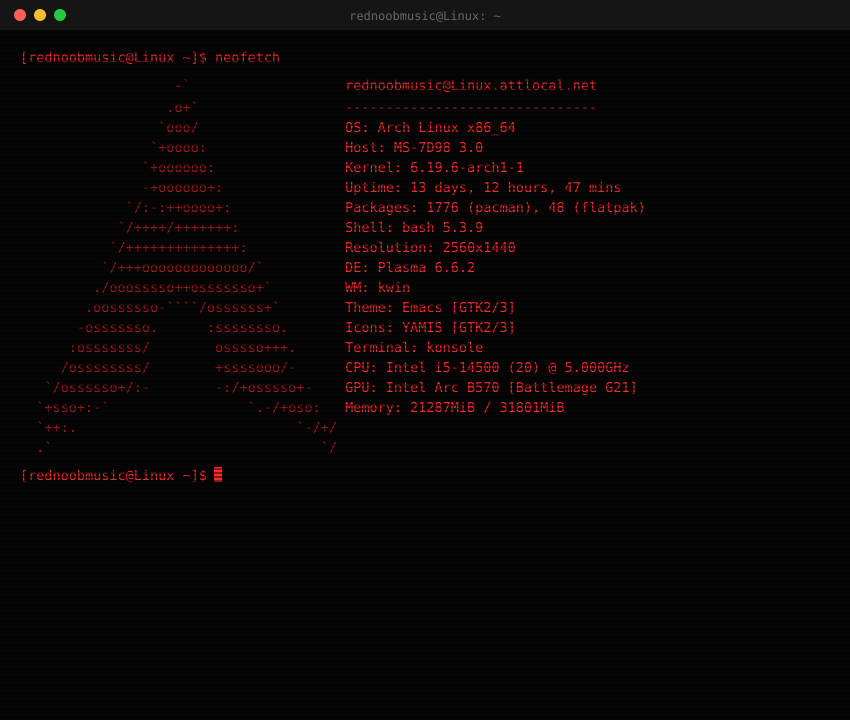

### projects

| repo | description |
|------|-------------|
| [furnace-piano-roll](https://github.com/rednoobmusic/furnace-piano-roll) | my fork of furnace with a somewhat useable piano roll |
| [pyside6player](https://github.com/rednoobmusic/pyside6player) | Python3 media player that uses PySide6 for GUI and ffmpeg for decoding |
| [MUVisualizer](https://github.com/rednoobmusic/MUVisualizer) | Visualizer and screen mirroring tool for sound modules with GM Display support |

